

  <a href="https://tradersentertainment.github.io/nothistorygamedemo/">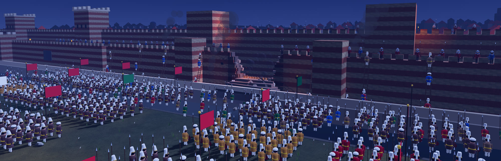</a>

  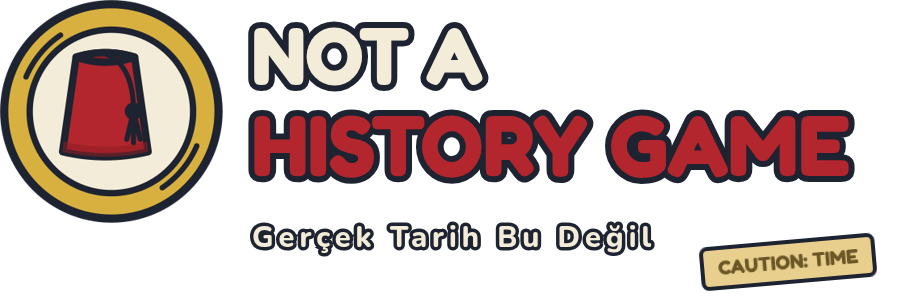
  &nbsp;&nbsp;
  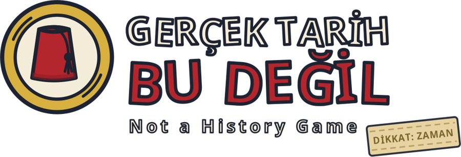

  <a href="https://github.com/TradersEntertainment/nothistorygamedemo/releases/latest"><b>⬇️ Download / İndir</b></a> ·
  <a href="https://tradersentertainment.github.io/nothistorygamedemo/?lang=en">🌐 Website</a> ·
  <a href="https://www.youtube.com/watch?v=Q5apIK1dYms">🎬 Trailer / Fragman</a> ·
  <a href="https://tradersentertainment.github.io/nothistorygamedemo/story.html">🗺️ Story map / Hikâye haritası</a> ·
  <a href="https://tradersentertainment.github.io/nothistorygamedemo/presskit.html">📰 Press kit / Basın kiti</a>

---

## 🇬🇧 Not a History Game

**Istanbul, 1453.** Uncle Hikmet's duct-taped time machine actually works. The only problem: he sent an insurance salesman.

Tolga pitches a risk matrix to Sultan Mehmed, accidentally blows up Urban's giant cannon, fills out forms in seven copies in Byzantium, and still tries to make his Monday 9 a.m. meeting.

- 🎙️ Fully voiced comedy adventure, in **English and Turkish**
- 🔀 Every choice bends history: **23 different endings**, 27 chapters
- ⚔️ **The siege of 1453 from both sides:** stand on the Byzantine walls or in the Ottoman camp
- ⏱️ About 2–3 hours per playthrough, made for replays and streams
- 🎮 Keyboard & mouse or gamepad · Windows · macOS · Linux / Steam Deck

## 🇹🇷 Gerçek Tarih Bu Değil

**1453, İstanbul.** Pijamalı mucit Hikmet Amca'nın koli bantlı zaman makinesi çalışıyor. Tek sorun: gönderdiği kişi bir sigortacı.

Tolga, Fatih'e risk tablosu sunuyor, Urban'ın topunu yanlışlıkla havaya uçuruyor, Bizans'ta yedi nüsha form dolduruyor ve pazartesi 09:00 toplantısına yetişmeye çalışıyor.

- 🎙️ Tamamen **Türkçe ve İngilizce** seslendirilmiş komedi-macera
- 🔀 Her seçim tarihi değiştirir: **23 farklı final**, 27 bölüm
- ⚔️ **1453 kuşatması iki taraftan:** Bizans surlarında ya da Osmanlı ordugâhında
- ⏱️ İlk oynanış yaklaşık 2–3 saat
- 🎮 Klavye-fare ya da gamepad · Windows · macOS · Linux / Steam Deck

## 💥 The Great Shot / Büyük Atış

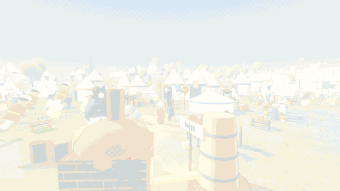

## 📸 Screenshots / Oyundan kareler

| | |
|:--:|:--:|
| 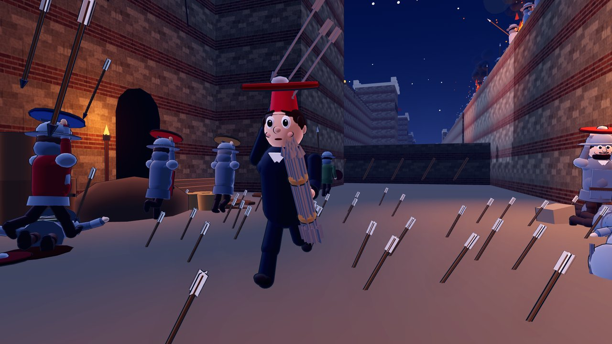 | 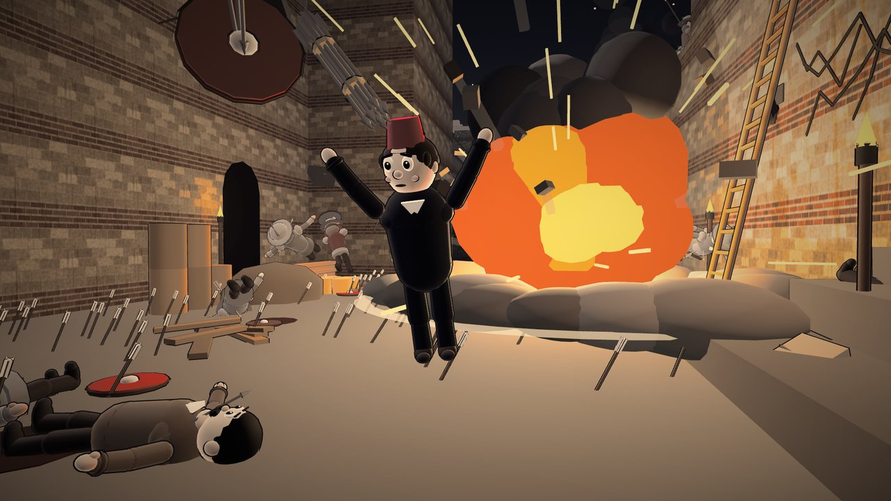 |
| 29 May 1453, 1:30 AM: arrows on a borrowed shield · *Ok yağmuru* | Freeze frame. Yep, that's me. · *Donan kare* |
| 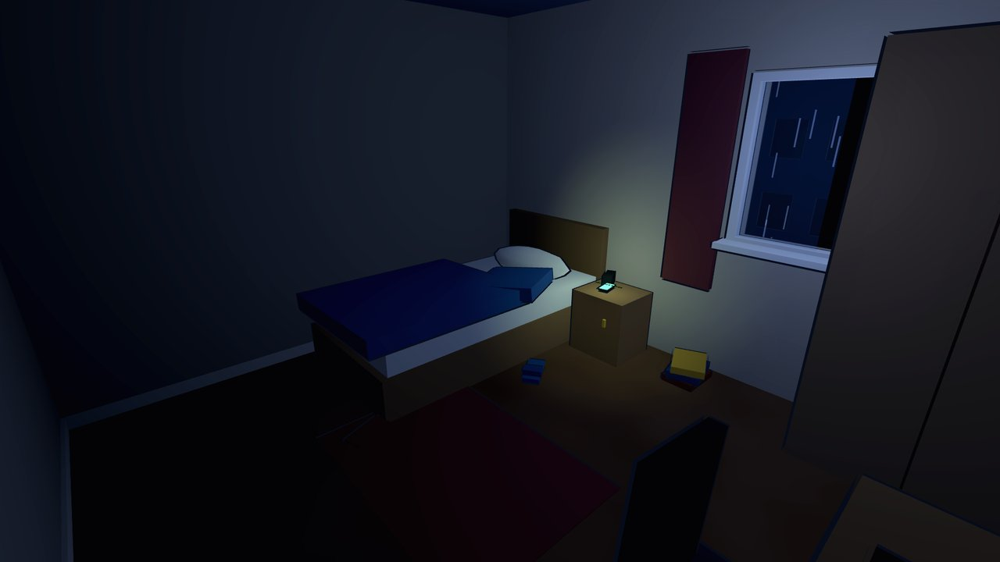 | 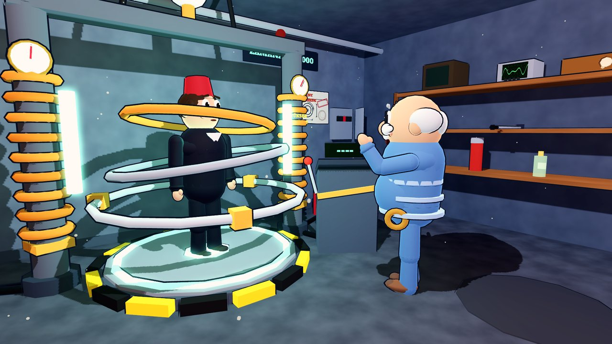 |
| 3 AM. The phone rings. It's Uncle Hikmet. · *Gece 03.00* | "It's stuck! It needs a kick!" · *Zamanatör 3000* |
| 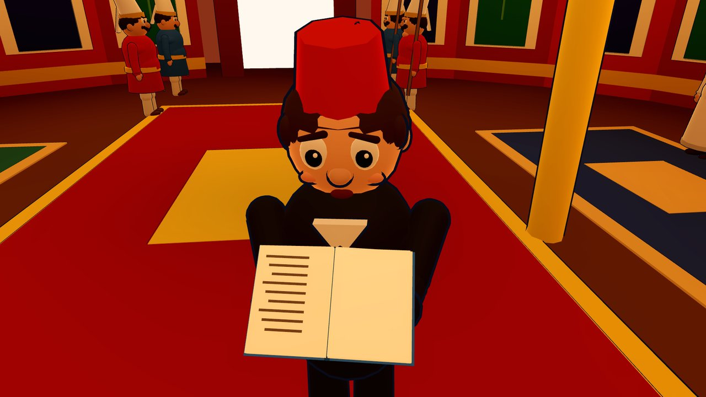 | 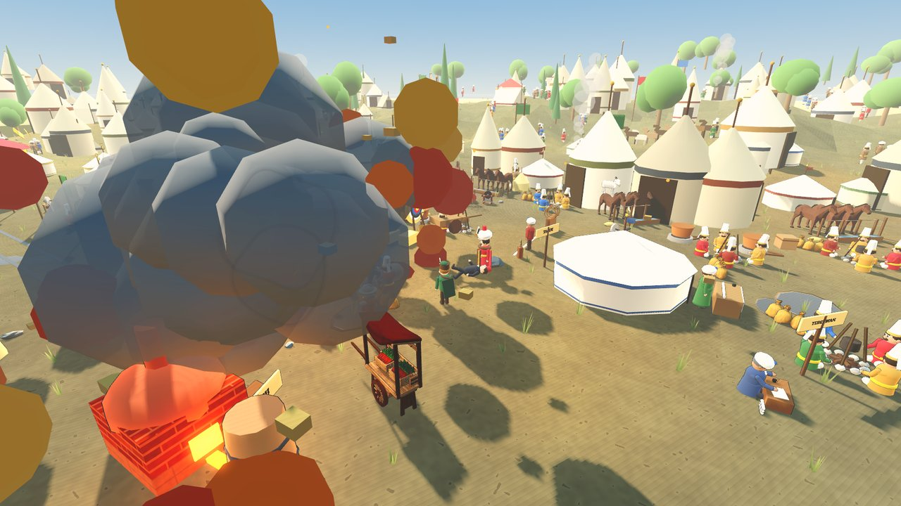 |
| "Will this city fall?" · *Tarih kitabı otağda* | Urban's cannon went off bigger than planned · *Büyük Atış* |
| 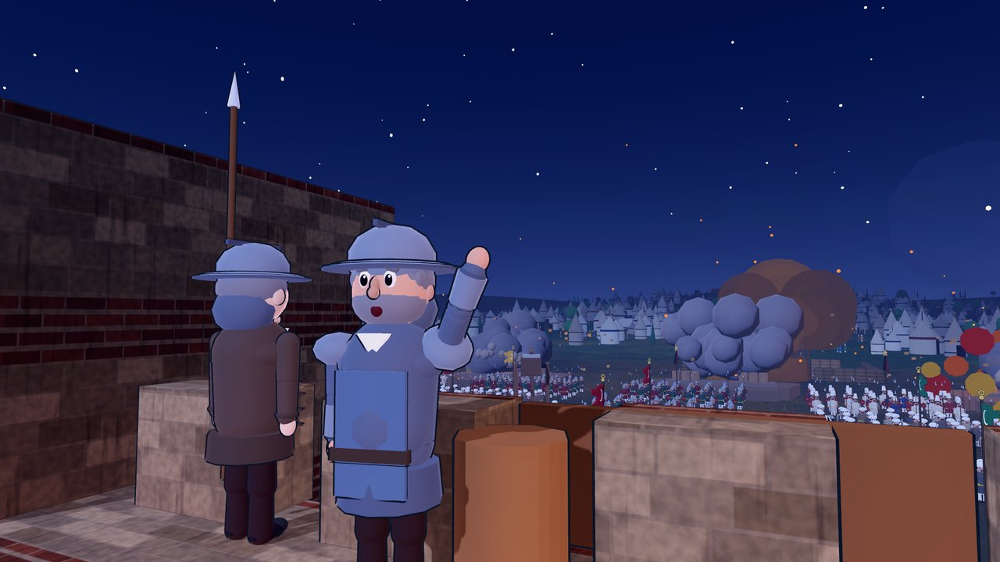 | 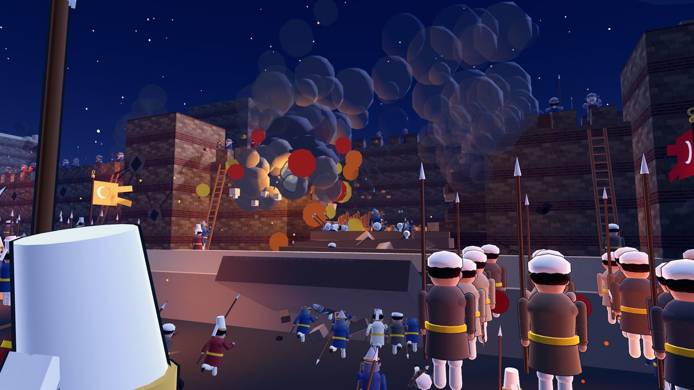 |
| "Smoke! The great gun! Take cover!" · *Surda gözcü* | The final assault at the breach · *Son hücum* |
| 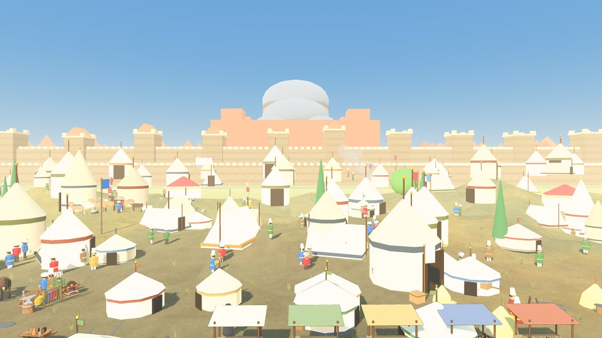 | 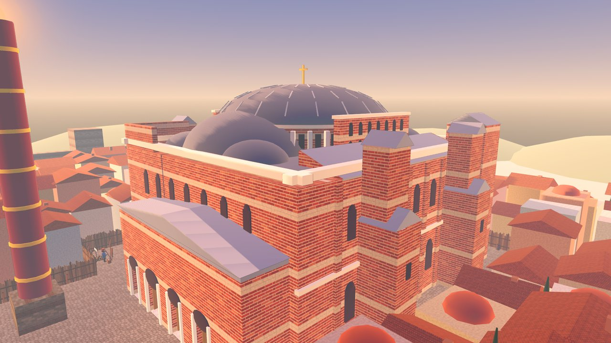 |
| The Ottoman camp before the walls · *Ordugâh* | Hagia Sophia and the rooftops of Constantinople · *Ayasofya* |

Screenshots show the Turkish interface; the whole game is also fully playable and voiced in English.

## 🗂️ Chapters / Bölümler

  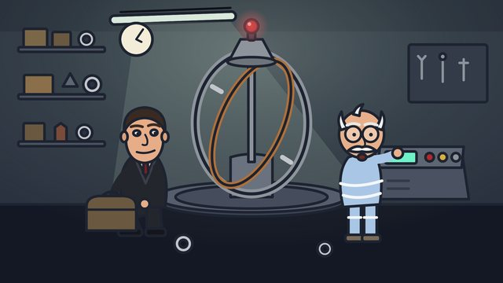 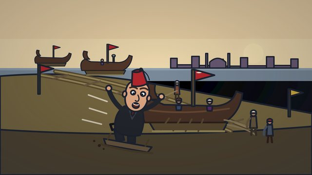 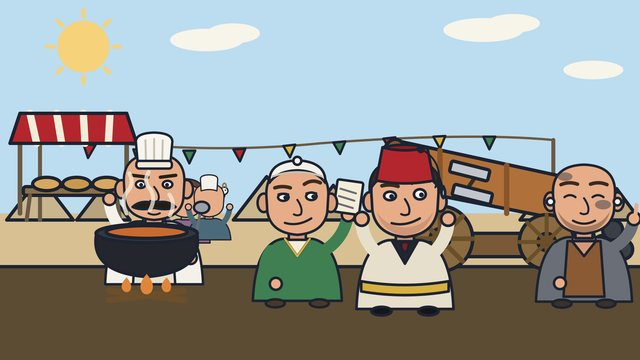 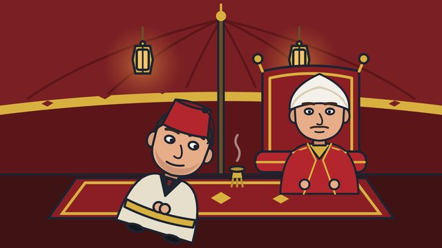
  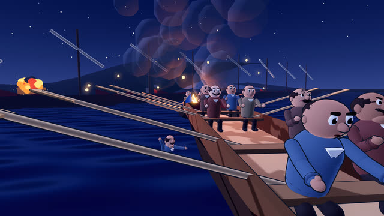 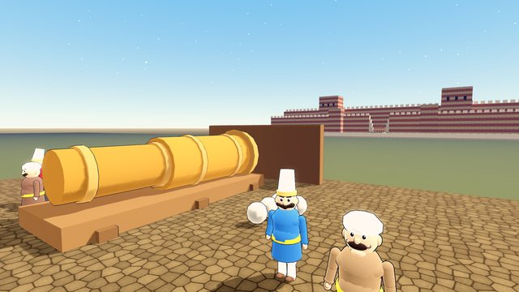 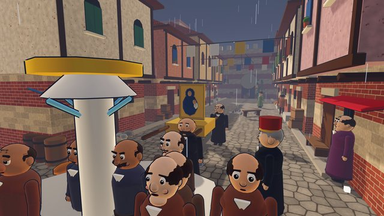 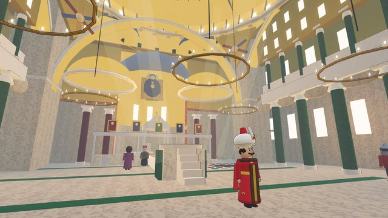

## ⬇️ Download / İndir

**[Latest release / En yeni sürüm](https://github.com/TradersEntertainment/nothistorygamedemo/releases/latest)**

| | 🇬🇧 | 🇹🇷 |
|---|---|---|
| 🪟 **Windows** | Run `GercekTarihBuDegil-Setup-…exe`. If you see “Windows protected your PC”: **More info → Run anyway** (the game is unsigned, that's normal). | `GercekTarihBuDegil-Setup-…exe` dosyasını çalıştır. "Bilgisayarınızı korudu" çıkarsa: **Ek bilgi → Yine de çalıştır** (oyun imzasız olduğu için normaldir). |
| 🍎 **macOS** | Unzip `GercekTarihBuDegil-macOS-…zip`, right-click the app → **Open**. | `GercekTarihBuDegil-macOS-…zip` dosyasını aç, uygulamaya sağ tıkla → **Aç**. |
| 🐧 **Linux / Steam Deck** | Unzip `GercekTarihBuDegil-Linux-…zip` and run it. | `GercekTarihBuDegil-Linux-…zip` dosyasını aç ve çalıştır. |

Language and voice-over can be switched any time in the in-game Settings. · *Dil ve seslendirme oyun içinden, Ayarlar menüsünden değiştirilir.*

## 📺 Streamers & creators / Yayıncılar

Stream it, make videos, monetize them: no permission needed. We're curious whether anyone finds all 23 endings.

Oyunu yayında ve videolarında dilediğin gibi kullanabilir, gelir elde edebilirsin. İzin almana gerek yok.

---

© TradersEntertainment. All rights reserved. This repository only hosts downloadable builds of the game. · *Tüm hakları saklıdır. Bu depo yalnızca oyunun indirilebilir sürümlerini barındırır.*

*This is not real history. …well, a little bit. · Bu oyun gerçek tarih değildir. …ama biraz öyle.*
